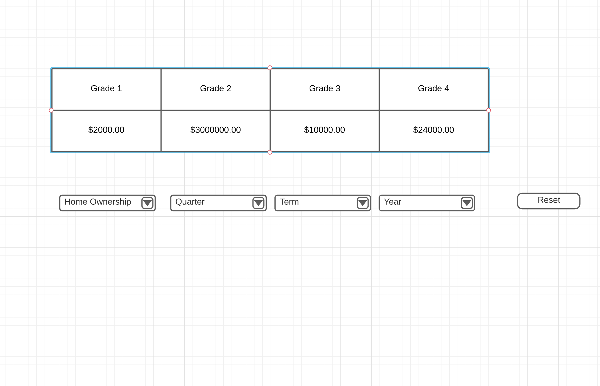

## Challenge

Give an endpoint called `getData` (method is located in `./src/request/api.js`) that returns data with the following data structure:

```json
[
  {
    "currentBalance": "13340.3884795713",
    "grade": "2",
    "homeOwnership": "MORTGAGE",
    "quarter": "4",
    "term": " 36 months",
    "year": "2015"
  },
  {
    "currentBalance": "10254.3896155371",
    "grade": "4",
    "homeOwnership": "RENT",
    "quarter": "3",
    "term": " 36 months",
    "year": "2014"
  }
]
```
1. Create a table (reference `./wireframe/Table.png`), where each column is the unique grade value in the data and the first row is the total aggregation of the current balance for each grade.



2. Build four dropdowns for home ownership, quarter, term and year that will filter out the data and be reflected onto the table. Each dropdown will have unique values that you will need to generate from the data.

3. Create a reset button that resets the data and filter.

4. Please develop as if you're shipping to production.

BONUS POINTS(optional):
  Build a Bar graph (reference `./wireframe/Bar Chart.png`) using a library of your choosing, where the x-axis is the loan grouped by grade and the y-axis is the total current balance for each grade.
    - If you don't know a charting library, we recommend `recharts` which is already included in the package.json

  The filter dropdowns should update both the table and bar graph

Note: To run this project make sure that you are using Node `v14.20.0`